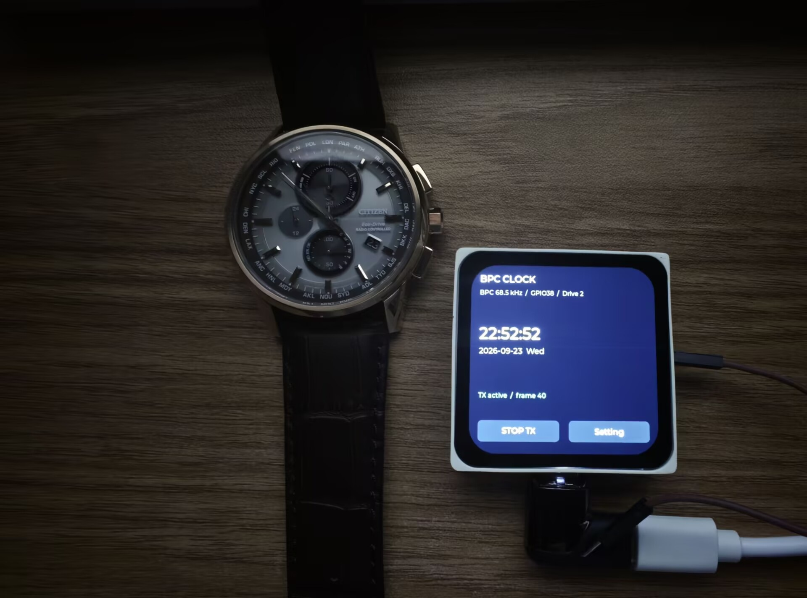

# Radio Time Signal Generator

基于 **ESP-Mosaico / ESP32-S31** 的低频授时信号发生器，通过 Wi-Fi 获取 NTP 时间，用 GPIO 产生载波和时间码，供近距离电波钟表接收实验使用。

**当前只实现 BPC。** JJY、WWVB、DCF77、MSF 已在界面中列出，但均为禁用占位项。

## 硬件与协议

- 开发板：Mosaico，ESP32-S31、16 MB Flash、480×480 CO5300 触摸屏。
- 输出：默认 **GPIO38**，杜邦线一端接 GPIO，另一端悬空作为天线。
- 固件：独立启动，不加载 Iris；ESP-IDF 6.1、LVGL 9.5.0。
- 设备时钟：NTP 保持 UTC，BPC 按 UTC+8 编码。没有测试时间偏移或手动时间模式。

| 协议 | 地区 | 载波 | 状态 |
| --- | --- | --- | --- |
| BPC | 中国 | 68.5 kHz | 已实现 |
| JJY | 日本 | 40 / 60 kHz | 未实现，禁用 |
| WWVB | 美国 | 60 kHz | 未实现，禁用 |
| DCF77 | 欧洲 | 77.5 kHz | 未实现，禁用 |
| MSF | 英国 | 60 kHz | 未实现，禁用 |

## 使用

1. **STOP TX / START TX** 控制输出。断网或 NTP 时间过期会暂停；重连后重新请求 NTP。
2. **Setting → Output → Antenna GPIO** 可以用数字键盘输入引脚编号。
3. **Setting → Protocol** 选择信号协议。

### 天线引脚

默认值为 **38** ，需要在该引脚处连接杜邦线（杜邦线另一头悬空）作为天线。

驱动档位 0–3 约对应 5/10/20/40 mA 的驱动能力，默认 2。它不是校准的射频功率设置，电压仍是约 3.3 V，接收距离不保证随档位成比例增加。
